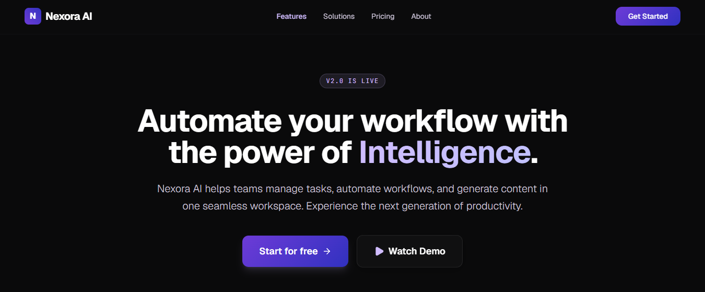
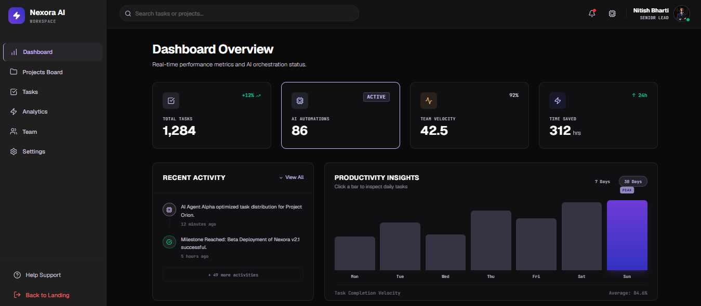
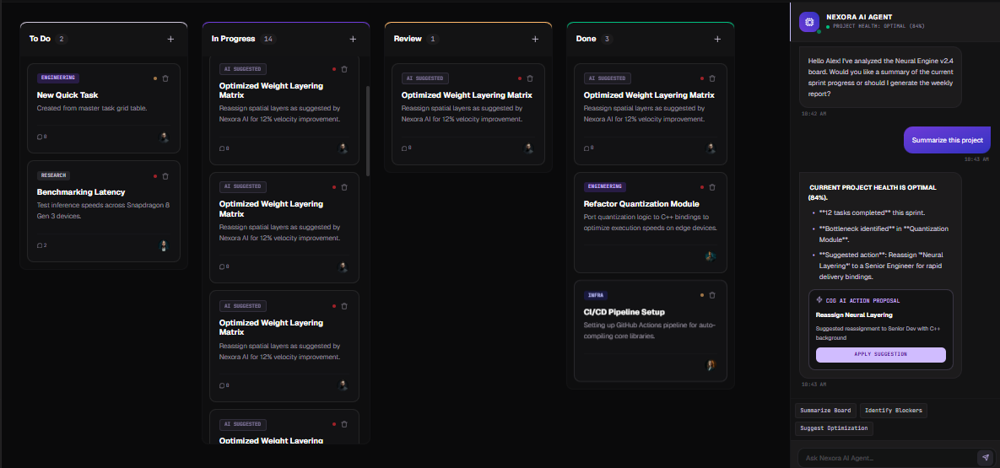
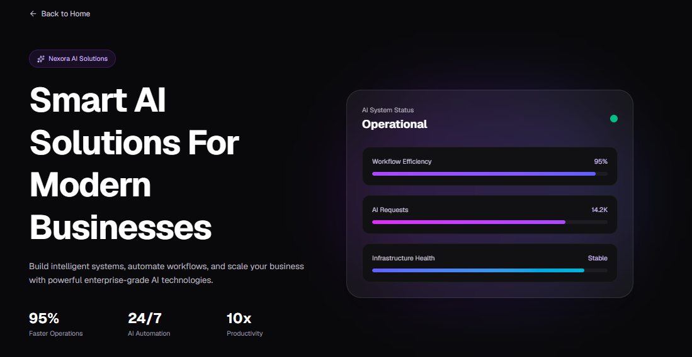

# 🚀 Nexora AI

<div align="center">



<br />
<br />

# AI Powered Workspace For Modern Teams

Nexora AI is an intelligent productivity and workflow automation platform built for modern businesses and development teams.

It combines project management, AI automation, analytics, task orchestration, and real-time collaboration into one seamless workspace.

<br />


</div>

---

# ✨ Overview

Nexora AI is designed to solve one major problem:

> Teams use too many disconnected tools for productivity, collaboration, automation, and analytics.

Nexora AI brings everything together into a single AI powered ecosystem where teams can:

- Manage projects efficiently
- Track tasks visually
- Automate repetitive workflows
- Monitor analytics in real time
- Get AI based recommendations
- Improve team productivity
- Generate intelligent insights

The platform acts like an AI powered operating system for businesses and development teams.

---

# 🧠 Core Features

## 📌 Smart Dashboard

The dashboard provides a complete real-time overview of:

- Task completion metrics
- Team performance
- Workflow analytics
- AI orchestration status
- Productivity insights
- Time saved through automation

### Dashboard Preview



---

## 📋 AI Powered Kanban Board

Nexora AI includes a modern Kanban system with AI assisted task optimization.

### Features

- Drag and drop task management
- AI generated suggestions
- Workflow prioritization
- Sprint management
- Real-time updates
- Team collaboration

### Kanban Board Preview



---

## 🤖 AI Agent Assistant

The integrated AI Agent helps teams:

- Analyze project health
- Detect bottlenecks
- Suggest optimizations
- Recommend task reassignment
- Generate summaries
- Improve productivity

This transforms Nexora AI from a normal project manager into an intelligent decision making system.

---

## 📊 Productivity Analytics

Track team efficiency with advanced insights:

- Daily productivity reports
- Task velocity tracking
- Automation impact metrics
- Team performance analysis
- Smart forecasting

---

## 🏢 Enterprise AI Solutions

Nexora AI provides scalable AI infrastructure for modern businesses.

### Solutions Include

- Workflow automation
- AI orchestration
- Infrastructure monitoring
- Enterprise analytics
- Intelligent resource allocation
- Real-time operational insights

### Solutions Page Preview



---

# 🎯 Problems Nexora AI Solves

| Problem | Nexora AI Solution |
|---|---|
| Too many productivity tools | Unified AI workspace |
| Poor workflow visibility | Real-time analytics dashboard |
| Manual repetitive tasks | AI automation |
| Low productivity | Smart optimization engine |
| Poor collaboration | Shared workspace system |
| Lack of insights | AI generated analytics |
| Team bottlenecks | Intelligent recommendations |

---

# ⚡ Tech Stack

## Frontend

- React
- TypeScript
- Tailwind CSS
- Vite
- Framer Motion
- React Router

## AI Layer

- OpenAI API
- LangChain
- AI Agents
- Workflow Intelligence
- Recommendation Engine

---

# 🏗️ Project Architecture

```bash
Nexora-AI/
│
├── src/
│   ├── components/
│   ├── pages/
│   ├── layouts/
│   ├── hooks/
│   ├── assets/
│   └── animations/
│
├── public/
│   └── assets/
│
├── styles/
└── README.md
```

---

# 🔥 Landing Page

The landing page is designed with a futuristic modern UI inspired by AI operating systems and enterprise SaaS platforms.

### Features

- Modern dark theme
- Animated gradients
- Responsive design
- Smooth UI interactions
- Conversion optimized layout

### Landing Page Preview


---

# 🚀 Future Roadmap

## Upcoming Features

- AI generated reports
- Voice enabled AI assistant
- Multi workspace support
- AI workflow builder
- Predictive analytics
- Team performance scoring
- AI meeting summarizer
- Smart notifications
- Role based access control
- Enterprise integrations

---

# 📱 Responsive Design

Nexora AI is fully optimized for:

- Desktop
- Tablet
- Mobile Devices

---

# 🧩 Installation

## Clone Repository

```bash
git clone https://github.com/your-username/nexora-ai.git
```

## Navigate To Project

```bash
cd nexora-ai
```

## Install Dependencies

```bash
npm install
```

## Start Development Server

```bash
npm run dev
```

---

# ⚙️ Environment Variables

Create a `.env` file:

```env
VITE_API_URL=http://localhost:5000
OPENAI_API_KEY=your_api_key
```

---

# 📸 Screenshots

## Dashboard


---

## AI Workspace


---

## Landing Page


---

## Solutions Page


---

# 🌟 Why Nexora AI?

Nexora AI is more than just a task manager.

It combines:

- AI intelligence
- Workflow automation
- Analytics
- Collaboration
- Smart productivity

into one futuristic platform built for modern teams.

---

# 📊 GitHub Stats

<table>
<tbody>
<tr border="none">

<td width="50%" align="center">


<br />
<br />


</td>

<td width="50%" align="center">


</td>

</tr>
</tbody>
</table>

---

# 🤝 Contributing

Contributions are welcome.

```bash
Fork the repository
Create your feature branch
Commit your changes
Push to the branch
Open a Pull Request
```

---

# 📄 License

This project is licensed under the MIT License.

---

# 👨‍💻 Author

## Nitish Bharti

Built with passion for AI, automation, and futuristic productivity systems.

---

# 🌐 Connect With Me

<div align="center">

🔗 LinkedIn:  
<a href="https://www.linkedin.com/in/nitish-kumar-bharti-631a37359/" target="_blank">
Nitish Kumar Bharti
</a>

<br />
<br />

📧 Email:  
codesnippet17@gmail.com

</div>

---

<div align="center">

# ⭐ If you like this project, give it a star on GitHub ⭐

</div>